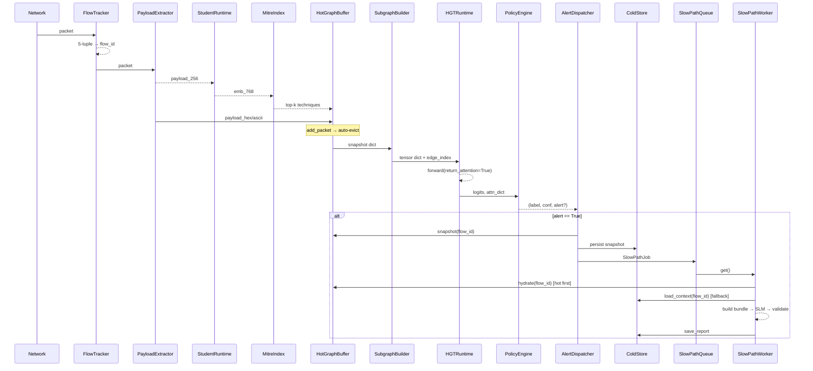

# Thiết Kế Lớp Cầu Nối Fast Path ↔ Slow Path

> Cập nhật theo `docs/unified_graph_growth_strategy_vi.md`: `ColdStore` trong tài
> liệu này chỉ còn là fallback JSONL khi tắt `graph_store`. Runtime hiện tại dùng
> `PersistentGraphStore` làm source of truth, HotGraphBuffer là cache RAM, slow
> path hydrate từ graph store trước.

Tài liệu này đặc tả chi tiết lớp runtime nằm giữa **Fast Path** (online detection)
và **Slow Path** (XAI report generation) đã được triển khai trong
`src/graphslm_ids/slow_path/`. Mục tiêu là khép kín pipeline online: từ packet
thô → HGT inference → quyết định alert → đẩy job sang Slow Path → Slow Path
hydrate context và sinh báo cáo.

Phạm vi tài liệu:

- Đánh giá khoảng trống hiện tại giữa hai path.
- Đặc tả module mới (file, class, interface, pseudocode).
- Hợp đồng dữ liệu (data contracts) đảm bảo Slow Path không phải sửa.
- Mô hình concurrency, persistence, error handling.
- Lộ trình implement và kiểm thử.

Tài liệu này KHÔNG thay đổi thiết kế Slow Path đã chốt trong
[slm_slow_path_xai_design_vi.md](slm_slow_path_xai_design_vi.md). Nó chỉ
hiện thực hóa các giả định mà Slow Path đang dựa vào (Hot Buffer, ColdStore,
counterfactual model, SlowPathJob).

---

## 1. Trạng Thái Hiện Tại

### 1.1 Đã có

```text
Offline pipeline (console scripts -> src/graphslm_ids/offline_path/):
  - extract_payload_dataset.py
  - build_teacher_targets.py
  - train_student_cnn.py
  - export_student_onnx.py
  - export_student_embeddings.py
  - build_mitre_technique_embeddings.py
  - build_three_tier_graph_artifact.py
  - train_hgt_flow_classifier.py

Slow Path (src/graphslm_ids/slow_path/):
  - context_hydrator.py
  - evidence_builder.py / evidence_ranker.py / evidence_bundle.py
  - report_generator.py / report_validator.py / fallback_template.py
  - slm_client.py
  - slow_path_worker.py
  - hot_buffer_adapter.py     <-- adapter, KHÔNG phải buffer thật
  - types.py (SlowPathJob, FlowContext, PacketContext, ...)
```

### 1.2 Khoảng trống

| # | Module thiếu | Hệ quả |
|---|---|---|
| 1 | Hot Graph Buffer | Adapter không có nguồn dữ liệu live; ContextHydrator luôn fail |
| 2 | Flow Tracker | Không có cách map packet → flow_id ở runtime |
| 3 | Online payload extractor | Không có cách lấy payload 256B từ packet đang truyền |
| 4 | Student CNN runtime | ONNX session chưa wrap; không tạo được embedding online |
| 5 | MITRE index runtime | Không có cosine top-k query online |
| 6 | K-hop subgraph builder | Không build được tensor input cho HGT từ Hot Buffer |
| 7 | HGT runtime wrapper | Chưa load checkpoint; chưa export attention dạng dict |
| 8 | Policy engine | Logits → label/confidence/decision chưa có |
| 9 | Alert dispatcher | SlowPathJob chưa được tạo và đẩy vào queue |
| 10 | Cold Store | Hydrator fallback không có storage |
| 11 | Counterfactual model | EvidenceBuilder nhận `counterfactual_model=None` |
| 12 | Pipeline config loader | `pipeline.example.yaml` không có code đọc |
| 13 | Entry script | Không có cách khởi động pipeline online end-to-end |

Toàn bộ lớp này cần thiết để Slow Path có dữ liệu vận hành.

---

## 2. Tổng Quan Kiến Trúc Mới

### 2.1 Cây thư mục đề xuất

```text
src/graphslm_ids/
├── fast_path/                          [MỚI — data plane]
│   ├── __init__.py
│   ├── flow_tracker.py
│   ├── payload_extractor_online.py
│   ├── student_runtime.py
│   ├── mitre_index.py
│   ├── hot_graph_buffer.py             ★ trung tâm
│   ├── subgraph_builder.py
│   ├── hgt_runtime.py
│   ├── policy_engine.py
│   └── alert_dispatcher.py
│
├── runtime/                            [MỚI — control plane]
│   ├── __init__.py
│   ├── pipeline_config.py
│   ├── cold_store.py
│   ├── counterfactual.py
│   └── runtime_pipeline.py             ★ orchestrator
│
└── slow_path/                          [GIỮ NGUYÊN]
```

Lý do tách `fast_path/` (data plane) và `runtime/` (control plane):

- `fast_path/` chỉ phụ thuộc `models/`, `data/`, không import slow_path.
- `runtime/` cấu hình + lắp ghép cả hai path; là chỗ duy nhất import cả
  `fast_path/` lẫn `slow_path/`.
- Điều này giữ cycle import = 0 và cho phép test fast_path độc lập.

### 2.2 Sequence diagram tổng



### 2.3 Phân tách dữ liệu

```text
Live, mutable state          : HotGraphBuffer (RAM, TTL)
Frozen alert snapshot        : SlowPathJob.subgraph_snapshot (dict copy)
Long-term context store      : ColdStore (JSONL trên disk)
Static knowledge             : MitreIndex (load 1 lần, immutable)
Model checkpoints            : Student ONNX, HGT .pt (load 1 lần)
```

---

## 3. Đặc Tả Từng Module

Mỗi mục dưới gồm: trách nhiệm, public interface, pseudocode quan trọng,
phụ thuộc.

### 3.1 `fast_path/flow_tracker.py`

**Trách nhiệm**: Map packet → `flow_id` ổn định trong cửa sổ idle. Phát sinh
`flow_id` mới khi 5-tuple không khớp hoặc đã idle quá `idle_timeout`.

```python
@dataclass
class FlowKey:
    src_ip: str; dst_ip: str
    src_port: int; dst_port: int
    protocol: str

@dataclass
class FlowState:
    flow_id: str
    first_seen: float
    last_seen: float
    packet_count: int

class FlowTracker:
    def __init__(self, idle_timeout_seconds: float = 60.0): ...
    def update(self, pkt: PacketRecord, now: float) -> FlowState:
        key = self._make_key(pkt)
        state = self._table.get(key)
        if state is None or (now - state.last_seen) > self.idle_timeout:
            state = FlowState(flow_id=self._gen_id(), first_seen=now,
                              last_seen=now, packet_count=0)
            self._table[key] = state
        state.last_seen = now
        state.packet_count += 1
        return state

    def evict_idle(self, now: float) -> list[str]:
        # gọi định kỳ; trả về flow_id đã idle để ColdStore snapshot
        ...
```

**Phụ thuộc**: không có.

### 3.2 `fast_path/payload_extractor_online.py`

**Trách nhiệm**: Tách 256 byte payload đầu (TCP/UDP) như offline extractor đã
làm, dạng `np.uint8[256]` zero-padded; trả thêm hex/ascii preview cho buffer.

```python
class PayloadExtractor:
    def __init__(self, payload_length: int = 256): ...
    def extract(self, pkt) -> ExtractedPayload:
        # ExtractedPayload(payload_u8: np.ndarray, hex_64: str, ascii_64: str,
        #                  raw_len: int, src_ip, dst_ip, src_port, dst_port,
        #                  protocol, timestamp)
        ...
```

**Lưu ý**: dùng cùng định nghĩa với `graphslm-extract-payload` để
embedding online khớp distribution training.

### 3.3 `fast_path/student_runtime.py`

**Trách nhiệm**: Wrap ONNX Runtime session chạy `student_cnn.onnx` (đã export
trong pipeline offline).

```python
class StudentRuntime:
    def __init__(self, onnx_path: str, providers: list[str] | None = None,
                 normalize: bool = True): ...
    def embed(self, payload_u8: np.ndarray) -> np.ndarray:
        # input shape (1, 256), output (1, 768) → (768,) sau khi squeeze + L2 norm
        ...
    def embed_batch(self, payload_batch: np.ndarray) -> np.ndarray: ...
```

**Quan trọng**: phải L2-normalize giống offline để cosine với MITRE đúng.

### 3.4 `fast_path/mitre_index.py`

**Trách nhiệm**: Load `mitre_techniques_embeddings.npy` + metadata; cosine
top-k trên CPU (numpy). Optional faiss cho production.

```python
class MitreIndex:
    def __init__(self, embeddings_npy: str, techniques_csv: str,
                 technique_tactic_csv: str): ...
    def topk(self, emb: np.ndarray, k: int = 5,
             threshold: float | None = None) -> list[tuple[str, float]]:
        # trả [(technique_id, cosine_score)] đã sort desc
        ...
    @property
    def technique_to_tactic(self) -> dict[str, str]: ...
    @property
    def tactic_metadata(self) -> dict[str, dict]: ...
    @property
    def technique_metadata(self) -> dict[str, dict]: ...  # cho Slow Path
```

### 3.5 `fast_path/hot_graph_buffer.py` ★

**Trách nhiệm**: State trung tâm. Phải lộ ra **đúng** các attribute mà
[hot_buffer_adapter.py](../src/graphslm_ids/slow_path/hot_buffer_adapter.py)
đang đọc, để Slow Path không phải sửa.

#### 3.5.1 Hợp đồng attribute (bắt buộc)

```python
class HotGraphBuffer:
    # === Flow tier ===
    flow_features: dict[str, dict]           # flow_id → { src_ip, dst_ip, src_port,
                                              #            dst_port, protocol, ...,
                                              #            packet_count, total_payload_bytes,
                                              #            duration_seconds, flow_feature_stats}
    flow_to_packets: dict[str, list[str]]
    flow_to_mitre: dict[str, list[tuple[str, float]]]

    # === Packet tier ===
    packet_metadata: dict[str, dict]         # packet_id → {src_ip, dst_ip, src_port, ...}
    packet_payload_text: dict[str, str]      # hex preview
    packet_payload_ascii: dict[str, str]
    packet_timestamps: dict[str, float]
    packet_len_raw: dict[str, int]
    packet_attention: dict[str, float]                # ghi sau khi HGT chạy
    packet_counterfactual_drop: dict[str, float]      # ghi sau khi CF chạy
    packet_to_flow: dict[str, str]
    packet_to_mitre: dict[str, list[tuple[str, float]]]
    packet_embeddings: dict[str, np.ndarray]          # 768-D, dùng cho subgraph

    # === Knowledge tier (immutable) ===
    technique_features: dict[str, np.ndarray]
    technique_to_tactic: dict[str, str]
    tactic_metadata: dict[str, dict]
    mitre_metadata: dict[str, dict]                   # đầy đủ name/tactic/tactic_id
```

> Tham chiếu các tên alias mà adapter chấp nhận: xem
> [hot_buffer_adapter.py](../src/graphslm_ids/slow_path/hot_buffer_adapter.py)
> các hàm `_first_mapping(...)`. Tên trên là tên gốc đầu tiên — không cần alias.

#### 3.5.2 Public methods

```python
class HotGraphBuffer:
    def __init__(self,
                 ttl_seconds: float = 60.0,
                 max_events: int = 100_000,
                 max_packets_per_flow: int = 64,
                 max_techniques_per_node: int = 5,
                 mitre_index: MitreIndex | None = None): ...

    def add_packet(self, *, packet_id, flow_id,
                   embedding: np.ndarray,
                   payload_hex: str, payload_ascii: str,
                   payload_len_raw: int,
                   timestamp: float,
                   src_ip, dst_ip, src_port, dst_port, protocol,
                   mitre_topk: list[tuple[str, float]]) -> None: ...

    def update_attention(self, packet_attention: dict[str, float]) -> None: ...
    def update_counterfactual(self, packet_cf: dict[str, float]) -> None: ...

    def get_flow(self, flow_id) -> dict | None: ...
    def get_packets(self, flow_id) -> list[dict]: ...

    def evict_expired(self, now: float) -> list[str]: ...   # trả flow_id evicted
    def snapshot(self, flow_id: str) -> dict: ...           # plain dict, để put queue / cold store

    def __contains__(self, flow_id: str) -> bool: ...
    def stats(self) -> dict: ...                            # for monitoring
```

#### 3.5.3 Pseudocode `add_packet`

```text
with self._lock:
    1. self._event_queue.append((timestamp, "packet", packet_id, flow_id))
    2. self.packet_metadata[packet_id]   = {src_ip, dst_ip, ...}
    3. self.packet_payload_text[packet_id] = payload_hex
    4. self.packet_embeddings[packet_id] = embedding
    5. self.packet_to_flow[packet_id]    = flow_id
    6. self.packet_to_mitre[packet_id]   = mitre_topk[:max_techniques_per_node]
    7. self.flow_to_packets.setdefault(flow_id, []).append(packet_id)
       if len(...) > max_packets_per_flow:
            evicted = self.flow_to_packets[flow_id].pop(0)
            self._purge_packet(evicted)
    8. _update_flow_aggregate(flow_id, ...)        # packet_count, total bytes,
                                                    # min/max/mean pkt_len, IAT
    9. _refresh_flow_to_mitre(flow_id)             # max-pool packet_to_mitre
   10. if len(event_queue) > max_events: _evict_one_oldest()
```

#### 3.5.4 Pseudocode `evict_expired`

```text
evicted_flows = []
with self._lock:
    while event_queue and (now - event_queue[0].ts) > ttl_seconds:
        ev = event_queue.popleft()
        if ev.kind == "packet":
            self._purge_packet(ev.packet_id)
        elif ev.kind == "flow_idle_marker":
            evicted_flows.append(ev.flow_id)
            self._purge_flow(ev.flow_id)
return evicted_flows
```

#### 3.5.5 Pseudocode `snapshot(flow_id)` (lightweight, không hold lock lâu)

```text
with self._lock:
    pkt_ids = list(self.flow_to_packets.get(flow_id, []))
    flow    = dict(self.flow_features.get(flow_id, {}))
    packets = [
        {
            "packet_id": pid,
            "metadata": dict(self.packet_metadata[pid]),
            "payload_hex": self.packet_payload_text.get(pid, ""),
            "payload_ascii": self.packet_payload_ascii.get(pid, ""),
            "timestamp": self.packet_timestamps.get(pid, 0.0),
            "payload_len_raw": self.packet_len_raw.get(pid, 0),
            "embedding": self.packet_embeddings[pid].copy(),
            "mitre_topk": list(self.packet_to_mitre.get(pid, [])),
            "attention_weight": self.packet_attention.get(pid),
            "counterfactual_drop": self.packet_counterfactual_drop.get(pid),
        }
        for pid in pkt_ids
    ]
    return {
        "flow_id": flow_id,
        "flow": flow,
        "packets": packets,
        "flow_to_mitre": list(self.flow_to_mitre.get(flow_id, [])),
    }
```

### 3.6 `fast_path/subgraph_builder.py`

**Trách nhiệm**: Từ Hot Buffer + seed `flow_id` → tensor dict đúng định dạng
mà `HeteroGraphTransformer.forward(...)` đang nhận (tham khảo
[hgt.py](../src/graphslm_ids/models/hgt.py)).

```python
class SubgraphBuilder:
    def __init__(self,
                 buffer: HotGraphBuffer,
                 hops: int = 3,
                 add_reverse_edges: bool = True,
                 standardize_flow_features: bool = True,
                 flow_feature_stats: dict | None = None,    # mean/std từ training
                 packet_feature: str = "semantic"): ...

    def build(self, seed_flow_id: str) -> Subgraph:
        # 1. BFS K-hop trên Hot Buffer adjacency
        # 2. Map node_id → local index per node_type
        # 3. Trả:
        #    {
        #      node_features:   {"flow": Tensor[F_f], "packet": Tensor[F_p],
        #                        "technique": Tensor[F_t], "tactic": Tensor[T]},
        #      edge_index_dict: {(src,rel,dst): LongTensor[2, E]},
        #      edge_weight_dict: {...} (optional),
        #      packet_local_to_id: dict[int, str],
        #      flow_local_to_id:   dict[int, str],
        #      seed_flow_local_idx: int,
        #    }
        ...

    def to_snapshot_dict(self, sub: Subgraph) -> dict: ...
```

**Quan trọng**:

- Sử dụng cùng feature schema như offline graph builder
  (`graphslm-build-three-tier-graph`)
  để HGT đã train không bị shift distribution.
- Standardize bằng mean/std lưu trong meta JSON của graph artifact.

### 3.7 `fast_path/hgt_runtime.py`

```python
class HGTRuntime:
    def __init__(self,
                 checkpoint_path: str,
                 graph_meta_json: str,
                 device: str = "cpu"): ...

    @torch.no_grad()
    def infer(self, sub: Subgraph) -> HGTOutput:
        logits, attn = self.model(
            node_features=sub.node_features,
            edge_index_dict=sub.edge_index_dict,
            edge_weight_dict=sub.edge_weight_dict,
            return_attention=True,
        )
        # attn dict đã được model trả ở dạng per-edge mean-over-heads scalar.
        return HGTOutput(
            logits=logits[sub.seed_flow_local_idx],   # [num_classes]
            edge_attention=attn,
            label_to_index=self.label_to_index,
        )

    def aggregate_packet_attention(self, sub, attn) -> dict[str, float]:
        # Aggregate attention trên các edge type chứa packet (e.g.
        # ("flow","contains","packet") và ("packet","matches_technique","technique"))
        # về dict[packet_id -> max attention weight]
        ...
```

### 3.8 `fast_path/policy_engine.py`

```python
@dataclass
class PolicyDecision:
    label: str
    label_idx: int
    confidence: float
    top_classes: list[dict[str, Any]]
    should_alert: bool
    alert_threshold: float
    trigger_reason: str

class PolicyEngine:
    def __init__(self,
                 label_to_index: dict[str, int],
                 alert_threshold: float = 0.70,
                 alert_labels: tuple[str, ...] = ("suspicious", "malicious")): ...

    def decide(self, hgt_output: HGTOutput) -> PolicyDecision:
        probs = softmax(hgt_output.logits)
        top_idx = int(probs.argmax())
        label = self.index_to_label[top_idx]
        confidence = float(probs[top_idx])
        should_alert = (label in self.alert_labels
                        and confidence >= self.alert_threshold)
        return PolicyDecision(...)
```

### 3.9 `fast_path/alert_dispatcher.py`

**Trách nhiệm**: Chuyển `PolicyDecision` + buffer snapshot thành `SlowPathJob`
và đẩy vào `queue.Queue`. Đây là điểm duy nhất Fast Path import từ Slow Path.

```python
class AlertDispatcher:
    def __init__(self,
                 slow_queue: queue.Queue,
                 cold_store: ColdStore | None,
                 alert_id_prefix: str = "alert"): ...

    def dispatch(self,
                 decision: PolicyDecision,
                 flow_id: str,
                 buffer: HotGraphBuffer,
                 subgraph: Subgraph,
                 attention: dict[str, float],
                 timestamp: float) -> str | None:
        if not decision.should_alert:
            return None

        alert_id = self._gen_alert_id()
        snapshot = buffer.snapshot(flow_id)
        snapshot["graph_subgraph"] = subgraph.to_snapshot_dict()
        if self.cold_store is not None:
            self.cold_store.append_alert_snapshot(alert_id, flow_id, snapshot)

        job = SlowPathJob(
            alert_id=alert_id,
            flow_id=flow_id,
            predicted_label=decision.label,
            confidence=decision.confidence,
            subgraph_snapshot=snapshot["graph_subgraph"],
            hgt_attention=attention,
            timestamp=timestamp,
            top_classes=decision.top_classes,
            alert_threshold=decision.alert_threshold,
            predicted_label_idx=decision.label_idx,
        )
        self.slow_queue.put_nowait(job)
        return alert_id
```

> `SlowPathJob` đã được định nghĩa trong
> [types.py](../src/graphslm_ids/slow_path/types.py) — không thay đổi.

### 3.10 `runtime/cold_store.py`

**Trách nhiệm**: Persistent context store cho `ContextHydrator` khi Hot Buffer
đã evict; cũng nơi Slow Path lưu báo cáo cuối cùng.

```python
class ColdStore:
    """Append-only JSONL store + index in-memory flow_id → file_offset."""

    def __init__(self, path: str): ...

    def append_alert_snapshot(self, alert_id: str, flow_id: str,
                              snapshot: dict) -> None: ...

    def load_context(self, flow_id: str) -> GraphContext | None:
        # đọc snapshot mới nhất theo flow_id, build GraphContext giống adapter
        ...

    def save_report(self, *, alert_id, bundle, report,
                    validation, fallback_tier) -> None: ...

    def iter_reports(self, since: float | None = None) -> Iterator[dict]: ...
```

**Format JSONL**:

```json
{"type": "alert_snapshot", "alert_id": "...", "flow_id": "...",
 "ts": 1710000000.0, "snapshot": {...}}
{"type": "report", "alert_id": "...", "fallback_tier": 1,
 "bundle": {...}, "report": "# XAI ...", "validation": {...}}
```

`load_context` mở lại dict và build `GraphContext` đúng schema mà
[evidence_builder.py](../src/graphslm_ids/slow_path/evidence_builder.py) cần.

### 3.11 `runtime/counterfactual.py`

**Trách nhiệm**: Lấp khoảng trống `EvidenceBuilder.counterfactual_model`.

```python
class HGTCounterfactual:
    def __init__(self, hgt_runtime: HGTRuntime,
                 max_cf_packets: int = 10): ...

    def confidence_drops(self,
                         subgraph_snapshot: dict,
                         target_class_idx: int,
                         original_confidence: float,
                         packet_attention: dict[str, float]) -> dict[str, float]:
        # 1. Chọn top-k packet theo attention (giảm chi phí)
        # 2. Với mỗi packet, deep-copy node_features["packet"] (chỉ tensor đó)
        # 3. Zero hàng tương ứng → forward HGT → softmax → diff
        # 4. Trả dict[packet_id → drop]
        ...
```

Interface phải khớp với cách `EvidenceBuilder` đang gọi (kiểm tra
`evidence_builder.py` trước khi finalize signature).

### 3.12 `runtime/pipeline_config.py`

```python
@dataclass
class FastPathCfg:
    student_onnx: str
    mitre_embeddings: str
    techniques_csv: str
    technique_tactic_csv: str
    mitre_topk: int
    mitre_threshold: float | None
    payload_length: int

@dataclass
class HotGraphCfg:
    ttl_seconds: float
    max_events: int
    max_packets_per_flow: int
    max_techniques_per_node: int

@dataclass
class HGTCfg:
    checkpoint: str
    graph_meta_json: str
    device: str
    num_layers: int

@dataclass
class PolicyCfg:
    alert_threshold: float
    alert_labels: tuple[str, ...]

@dataclass
class SlowPathCfg: ...        # đã có dataclass tương đương trong slow_path
@dataclass
class SlmCfg: ...
@dataclass
class ValidatorCfg: ...

@dataclass
class PipelineConfig:
    fast_path: FastPathCfg
    hot_graph: HotGraphCfg
    hgt: HGTCfg
    policy: PolicyCfg
    slow_path: SlowPathCfg
    slm: SlmCfg
    validator: ValidatorCfg
    cold_store_path: str

    @classmethod
    def from_yaml(cls, path: str) -> "PipelineConfig": ...
```

### 3.13 `runtime/runtime_pipeline.py` ★

```python
class FastPathPipeline:
    def __init__(self, cfg: PipelineConfig):
        self.flow_tracker      = FlowTracker(cfg.hot_graph.ttl_seconds)
        self.payload_extractor = PayloadExtractor(cfg.fast_path.payload_length)
        self.student_runtime   = StudentRuntime(cfg.fast_path.student_onnx)
        self.mitre_index       = MitreIndex(...)
        self.hot_buffer        = HotGraphBuffer(..., mitre_index=self.mitre_index)
        self.subgraph_builder  = SubgraphBuilder(self.hot_buffer, hops=cfg.hgt.num_layers)
        self.hgt_runtime       = HGTRuntime(cfg.hgt.checkpoint, cfg.hgt.graph_meta_json)
        self.policy            = PolicyEngine(self.hgt_runtime.label_to_index,
                                              alert_threshold=cfg.policy.alert_threshold)
        self.cold_store        = ColdStore(cfg.cold_store_path)
        self.slow_queue        = queue.Queue(maxsize=cfg.slow_path.queue_max_size)
        self.dispatcher        = AlertDispatcher(self.slow_queue, self.cold_store)

        self.counterfactual    = HGTCounterfactual(self.hgt_runtime,
                                                   max_cf_packets=cfg.slow_path.max_cf_packets)
        self.slow_worker       = SlowPathWorker(
            config=SlowPathConfig(...),
            counterfactual_model=self.counterfactual,
            label_to_index=self.hgt_runtime.label_to_index,
            cold_store=self.cold_store,
        )

    def on_packet(self, raw_pkt) -> DetectionResult:
        now = time.time()
        flow_state = self.flow_tracker.update(raw_pkt, now)
        ext        = self.payload_extractor.extract(raw_pkt)
        emb        = self.student_runtime.embed(ext.payload_u8)
        topk       = self.mitre_index.topk(emb, k=cfg.fast_path.mitre_topk)

        self.hot_buffer.add_packet(
            packet_id=self._make_packet_id(),
            flow_id=flow_state.flow_id,
            embedding=emb,
            payload_hex=ext.hex_64,
            payload_ascii=ext.ascii_64,
            payload_len_raw=ext.raw_len,
            timestamp=ext.timestamp,
            src_ip=ext.src_ip, dst_ip=ext.dst_ip,
            src_port=ext.src_port, dst_port=ext.dst_port,
            protocol=ext.protocol,
            mitre_topk=topk,
        )

        sub = self.subgraph_builder.build(flow_state.flow_id)
        out = self.hgt_runtime.infer(sub)
        packet_attn = self.hgt_runtime.aggregate_packet_attention(sub, out.edge_attention)
        self.hot_buffer.update_attention(packet_attn)

        decision = self.policy.decide(out)
        alert_id = self.dispatcher.dispatch(
            decision, flow_state.flow_id, self.hot_buffer,
            sub, packet_attn, now,
        )

        # housekeeping
        idle = self.flow_tracker.evict_idle(now)
        for fid in idle:
            self.cold_store.append_alert_snapshot(
                alert_id=f"snap_{fid}", flow_id=fid,
                snapshot=self.hot_buffer.snapshot(fid),
            )
        self.hot_buffer.evict_expired(now)

        return DetectionResult(flow_state.flow_id, decision.label,
                               decision.confidence, alert_id)

    def start_slow_worker(self, daemon: bool = True) -> threading.Thread:
        thread = threading.Thread(
            target=self.slow_worker.run_queue,
            kwargs={"slow_path_queue": self.slow_queue,
                    "hot_buffer": self.hot_buffer,
                    "cold_store": self.cold_store},
            daemon=daemon,
        )
        thread.start()
        return thread
```

### 3.14 `graphslm-run-runtime`

CLI entry: đọc PCAP / live capture / replay file → gọi `pipeline.on_packet`.

```python
def main():
    cfg     = PipelineConfig.from_yaml(args.config)
    pipe    = FastPathPipeline(cfg)
    worker  = pipe.start_slow_worker()
    try:
        for pkt in iter_packets(args.input):
            pipe.on_packet(pkt)
    finally:
        pipe.slow_queue.put(None)   # sentinel
        worker.join(timeout=60)
```

---

## 4. Hợp Đồng Dữ Liệu Quan Trọng

### 4.1 SlowPathJob (đã có, không đổi)

Tham chiếu [types.py](../src/graphslm_ids/slow_path/types.py).

```text
alert_id, flow_id, predicted_label, confidence,
subgraph_snapshot (dict), hgt_attention (dict),
timestamp, top_classes, alert_threshold, predicted_label_idx
```

### 4.2 GraphContext (Hot Buffer Adapter trả về)

Tham chiếu
[hot_buffer_adapter.py](../src/graphslm_ids/slow_path/hot_buffer_adapter.py)
và [types.py](../src/graphslm_ids/slow_path/types.py). Buffer chỉ cần expose
đúng các attribute liệt kê ở Mục 3.5.1; Adapter đã handle cả mapping/method
form (`get_flow`, `get_packets`).

### 4.3 Cold Store snapshot

JSON dict tự đủ để build `GraphContext` mà không cần Hot Buffer:

```json
{
  "flow_id": "flow_00001234",
  "flow": { "src_ip": "...", "dst_ip": "...", ..., "flow_feature_stats": {...} },
  "packets": [
    { "packet_id": "...", "metadata": {...}, "payload_hex": "...",
      "payload_ascii": "...", "timestamp": ..., "payload_len_raw": ...,
      "mitre_topk": [["T1190", 0.84], ...],
      "attention_weight": 0.34, "counterfactual_drop": 0.21 }
  ],
  "flow_to_mitre": [["T1190", 0.84]],
  "mitre_metadata": { "T1190": {"technique_name": "...", "tactic": "...",
                                "tactic_id": "..."} }
}
```

---

## 5. Concurrency & Thread Safety

### 5.1 Mô hình thread

```text
Thread A (Fast Path / data plane):
  on_packet → HotBuffer.add_packet → HGT.infer → dispatch.put_nowait
  TUYỆT ĐỐI KHÔNG block I/O dài (cold store write phải async hoặc batched)

Thread B (Slow Path worker):
  SlowPathWorker.run_queue → context_hydrator → evidence_builder
                          → SLM (block I/O 1-30s)
                          → cold_store.save_report

Thread C (Maintenance):
  evict_expired theo lịch (5s) — gọi HotBuffer.evict_expired và flush ColdStore.
```

### 5.2 Lock

- `HotGraphBuffer._lock = threading.RLock()`. Mọi public method ôm lock.
- `snapshot()` clone dữ liệu trước khi nhả lock; Slow Path đọc bản clone.
- `ColdStore` nội tại lock cho file write (hoặc dùng `queue` + 1 writer thread).

### 5.3 Backpressure

- `slow_queue = queue.Queue(maxsize=N)`.
- `put_nowait` nếu queue đầy → drop alert kèm log + counter (alert priority có
  thể thêm sau). Không block Fast Path.

---

## 6. Counterfactual Integration

### 6.1 Khi nào tính

- **Sync (default)**: ngay trước khi dispatch alert. Tăng latency Fast Path
  ~ K × HGT_inference_time với K = `max_cf_packets`. Nên chỉ chạy khi
  `should_alert == True`.
- **Async (option)**: dispatch trước, worker compute CF rồi gắn vào bundle.
  Phức tạp hơn — để ablation.

### 6.2 Lựa chọn packet để CF

```text
candidates = sorted(packets_in_flow, key=lambda p: attention[p], reverse=True)
candidates = candidates[: max_cf_packets]
```

### 6.3 Pseudocode

```python
def confidence_drops(snapshot, target_idx, orig_conf, attention):
    sub = rebuild_subgraph_from_snapshot(snapshot)
    drops = {}
    for pkt_id in topk_by_attention(snapshot.packets, attention, k=max_cf_packets):
        local_idx = sub.packet_local_to_id_inverse[pkt_id]
        original_row = sub.node_features["packet"][local_idx].clone()
        sub.node_features["packet"][local_idx] = 0.0
        with torch.no_grad():
            logits, _ = hgt.model(...)
            new_conf = softmax(logits[sub.seed_flow_local_idx])[target_idx].item()
        sub.node_features["packet"][local_idx] = original_row
        drops[pkt_id] = orig_conf - new_conf
    return drops
```

### 6.4 Interface với EvidenceBuilder

`EvidenceBuilder.__init__(counterfactual_model=...)` — cần kiểm interface
hiện tại trong
[evidence_builder.py](../src/graphslm_ids/slow_path/evidence_builder.py). Adapter:

```python
class CounterfactualAdapter:
    def __init__(self, hgt_cf: HGTCounterfactual): ...
    def __call__(self, *args, **kwargs):
        # khớp signature mà evidence_builder gọi
        return self.hgt_cf.confidence_drops(...)
```

---

## 7. Cấu Hình Tổng Hợp (mở rộng `pipeline.example.yaml`)

```yaml
fast_path:
  student_onnx: outputs/student_cnn/student_cnn.onnx
  mitre_embeddings: data/mitre/mitre_techniques_embeddings.npy
  techniques_csv: data/mitre/mitre_techniques.csv
  technique_tactic_csv: data/mitre/mitre_technique_tactic_edges.csv
  mitre_topk: 5
  mitre_threshold: 0.82
  payload_length: 256

hot_graph:
  ttl_seconds: 60
  max_events: 100000
  max_packets_per_flow: 64
  max_techniques_per_node: 5

hgt_runtime:
  checkpoint: outputs/hgt_flow_classifier_t082_k5_l3_d01/hgt_flow_best.pt
  graph_meta_json: data/processed/graph_artifact_3tier_t082_k5.meta.json
  device: cpu
  num_layers: 3

policy:
  alert_threshold: 0.70
  alert_labels: [suspicious, malicious]

slow_path: { ... }            # giữ nguyên
slm:       { ... }            # giữ nguyên
validator: { ... }            # giữ nguyên

cold_store:
  path: data/runtime/events.jsonl
```

---

## 8. Chiến Lược Test

### 8.1 Unit test mới

| File | Nội dung |
|---|---|
| `tests/test_flow_tracker.py` | 5-tuple key, idle reset, gen flow_id |
| `tests/test_hot_graph_buffer.py` | add_packet → get_flow/get_packets, TTL evict, max_events, snapshot self-contained |
| `tests/test_hot_buffer_adapter_with_buffer.py` | tích hợp Buffer thật với adapter — đảm bảo khớp attribute |
| `tests/test_subgraph_builder.py` | K-hop coverage; edge_index đúng kiểu cho HGT |
| `tests/test_hgt_runtime.py` | load checkpoint giả, infer + attention dict không rỗng |
| `tests/test_policy_engine.py` | softmax → label/conf, threshold boundary |
| `tests/test_alert_dispatcher.py` | should_alert=False → không put queue; True → SlowPathJob đúng schema |
| `tests/test_cold_store.py` | append + load_context round-trip; load_report round-trip |
| `tests/test_counterfactual.py` | zero packet → conf giảm trên model dummy |
| `tests/test_runtime_pipeline_smoke.py` | feed N synthetic packet → buffer có dữ liệu, slow queue có job khi gặp packet "malicious" |

### 8.2 Integration replay

`graphslm-run-runtime`: chạy 1 PCAP nhỏ qua
`FastPathPipeline`, đợi worker xong, kiểm `data/runtime/events.jsonl` chứa ít
nhất 1 report Tier 1 hoặc Tier 3.

---

## 9. Lộ Trình Implement

```text
M1: HotGraphBuffer + FlowTracker + tests                         (1 tuần)
M2: PayloadExtractor + StudentRuntime + MitreIndex + tests       (3 ngày)
M3: SubgraphBuilder + HGTRuntime + tests                         (1 tuần)
M4: PolicyEngine + AlertDispatcher + ColdStore + tests           (3 ngày)
M5: HGTCounterfactual + lắp vào EvidenceBuilder + tests          (3 ngày)
M6: PipelineConfig + RuntimePipeline + entry script              (3 ngày)
M7: PCAP replay smoke + đo latency p50/p95                       (3 ngày)
```

Tổng ~5 tuần solo.

---

## 10. Rủi Ro & Giảm Thiểu

| Rủi ro | Tác động | Giảm thiểu |
|---|---|---|
| Online embedding lệch distribution offline | HGT sai class | Reuse đúng PayloadExtractor + L2 norm; test khớp với teacher |
| K-hop subgraph không khớp graph train | Attention vô nghĩa | Reuse đúng feature schema + standardize bằng stats từ meta.json |
| Counterfactual chậm | Latency Slow Path tăng | `max_cf_packets=10`; chỉ deep-copy `packet_x`; chạy CF parallel với SLM |
| Hot Buffer lock contention | Throughput Fast Path giảm | RLock; `snapshot` clone nhanh; chia shard theo `flow_id` nếu cần |
| Cold Store JSONL swell | Disk usage | Rotate theo size (cấu hình `max_size_mb`); GZIP rotated file |
| Pipeline config mismatch với artifact | Runtime crash | `from_yaml` validate path tồn tại + checksum graph_meta_json |
| Slow queue full | Drop alert | Tăng `queue_max_size`; log counter; ưu tiên malicious > suspicious |
| HGT macro-F1 0.36 | False alert nhiều | `alert_threshold` cao + ablation per-class threshold; ngoài phạm vi tài liệu này |

---

## 11. Checklist Sẵn Sàng Implement

```text
[ ] Đã review thiết kế với supervisor / nhóm
[ ] Đã chốt schema attribute HotGraphBuffer khớp HotBufferAdapter
[ ] Đã chốt SlowPathJob.subgraph_snapshot format
[ ] Đã có graph_meta_json chứa mean/std flow features
[ ] Đã export student_cnn.onnx và verify
[ ] Đã có mitre_techniques_embeddings.npy + technique-tactic CSV
[ ] Đã train HGT checkpoint baseline t082_k5_l3_d01
[ ] Đã cài Ollama + pull qwen2.5:3b-instruct-q4_k_m (cho Slow Path)
[ ] Đã thống nhất tên packet_id format (vd "pkt_<flow_id>_<seq>")
[ ] Đã định nghĩa label_to_index nhất quán giữa HGT train và policy
```

---

## 12. Tham Chiếu

- [slm_slow_path_xai_design_vi.md](slm_slow_path_xai_design_vi.md) — thiết kế Slow Path
- [streaming_hgt_runtime_v3_vi.md](streaming_hgt_runtime_v3_vi.md) — runtime architecture (NeutronRT incremental RTEC + RelGT centroids)
- [system_execution_flows.md](system_execution_flows.md) — sơ đồ training & runtime tổng
- [hot_buffer_adapter.py](../src/graphslm_ids/slow_path/hot_buffer_adapter.py) — alias attribute mà buffer phải lộ
- [hgt.py](../src/graphslm_ids/models/hgt.py) — chữ ký `forward(return_attention=True)`
- [pipeline.example.yaml](../configs/pipeline.example.yaml) — config baseline
