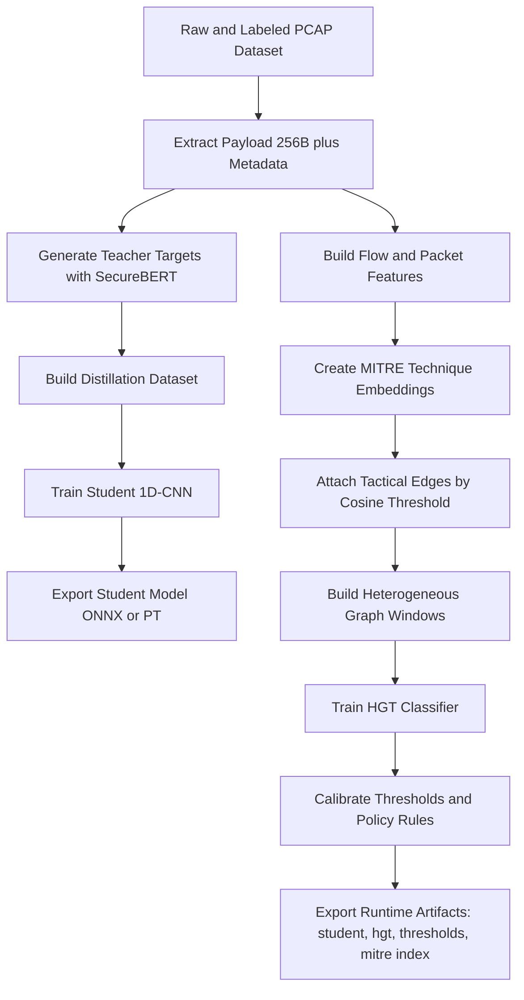
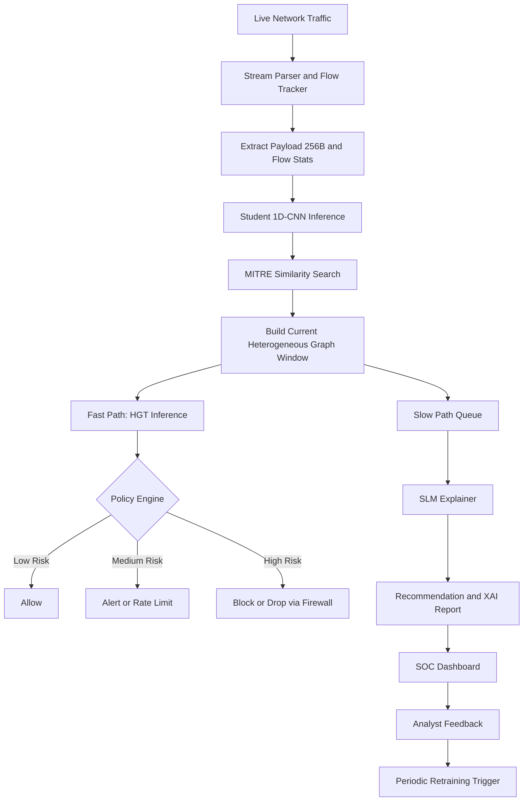

# System Execution Flows

This file contains two vertical Mermaid diagrams for thesis/report usage.

## 1) Training Pipeline (Offline)

```mermaid
flowchart TD
    A[Raw and Labeled PCAP Dataset] --> B[Extract Payload 256B plus Metadata]
    B --> C[Generate Teacher Targets with SecureBERT]
    C --> D[Build Distillation Dataset]
    D --> E[Train Student 1D-CNN]
    E --> F[Export Student Model ONNX or PT]

    B --> G[Build Flow and Packet Features]
    G --> H[Create MITRE Technique Embeddings]
    H --> I[Attach Tactical Edges by Cosine Threshold]
    I --> J[Build Heterogeneous Graph Windows]
    J --> K[Train HGT Classifier]
    K --> L[Calibrate Thresholds and Policy Rules]
    L --> M[Export Runtime Artifacts: student, hgt, thresholds, mitre index]
```

## 2) Runtime Pipeline (Online Real-time)

```mermaid
flowchart TD
    A[Live Network Traffic] --> B[Stream Parser and Flow Tracker]
    B --> C[Extract Payload 256B and Flow Stats]
    C --> D[Student 1D-CNN Inference]
    D --> E[MITRE Similarity Search]
    E --> F[Build Current Heterogeneous Graph Window]

    F --> G[Fast Path: HGT Inference]
    G --> H{Policy Engine}
    H -->|Low Risk| I[Allow]
    H -->|Medium Risk| J[Alert or Rate Limit]
    H -->|High Risk| K[Block or Drop via Firewall]

    F --> L[Slow Path Queue]
    L --> M[SLM Explainer]
    M --> N[Recommendation and XAI Report]
    N --> O[SOC Dashboard]
    O --> P[Analyst Feedback]
    P --> Q[Periodic Retraining Trigger]
```
