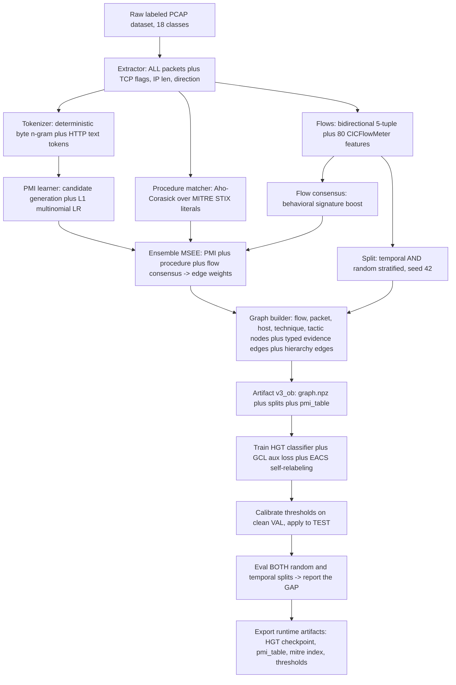
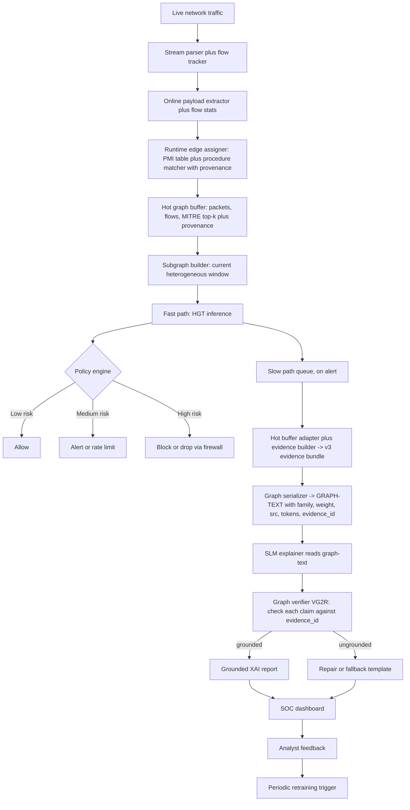

# System Execution Flows

This file contains two vertical Mermaid diagrams for thesis/report usage.
They describe the **v3 (`v3_ob`) pipeline**: zero learned encoders besides HGT
itself, MSEE evidence edges (PMI + procedure matcher + flow consensus), and an
evidence-grounded + verified SLM report on the slow path.

## 1) Training Pipeline (Offline, local CPU)

Notes:
- **No learned encoders besides HGT.** Packet→technique edges come from the
  Multi-Source Evidence Ensemble (MSEE): PMI counting + convex L1-LR refinement +
  Aho-Corasick procedure matching. The legacy SecureBERT-cosine `matches_technique`
  edge of v1 is removed.
- Stages are deterministic given seed 42; only HGT trains.
- EACS self-relabels suspect web-attack flows lacking MITRE evidence; the clean
  answer key and EACS anchor mask are eval-only and never enter any loss.

## 2) Runtime Pipeline (Online, fast path + slow path)

Notes:
- The fast-path runtime edge assigner reuses the **same** PMI table + procedure
  matcher as the offline build, carrying token/literal **provenance** through the
  hot buffer so the SLM report is auditable.
- The SLM does **not** read the HGT label alone. It reads the serialized evidence
  subgraph (**graph-text**) which contains the HGT decision *plus* the supporting
  evidence edges (`family=... w=... src=pmi tokens=...`) and per-element
  `evidence_id`s.
- **VG2R verifier** grounds every claim in the report against the graph-text
  `evidence_id`s and scores `numeric_accuracy`; ungrounded claims trigger repair
  or a deterministic fallback template instead of being emitted.
